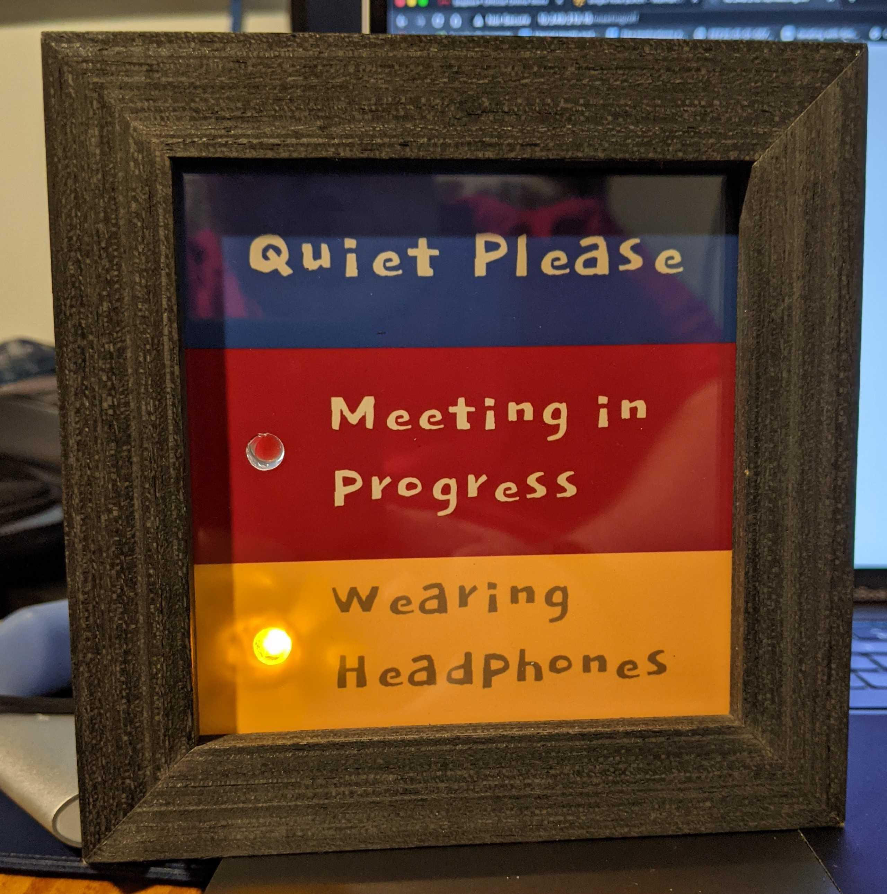
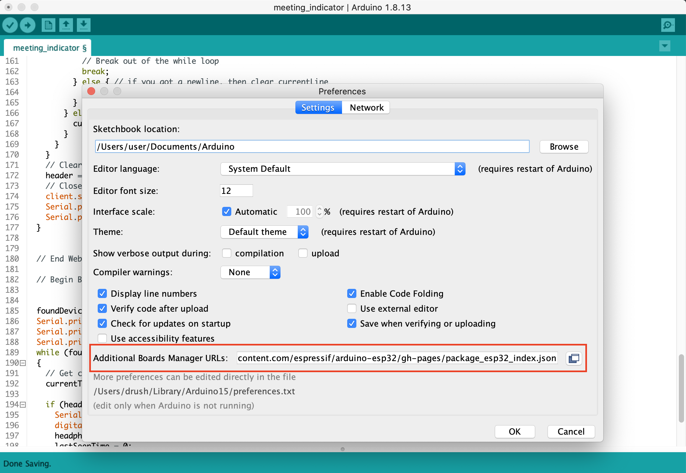
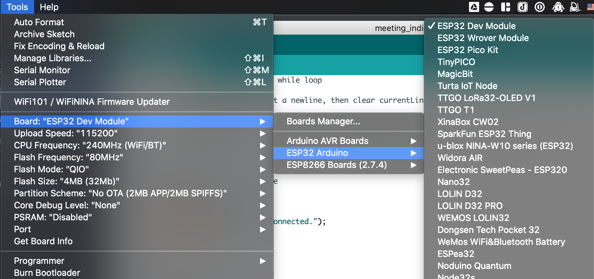
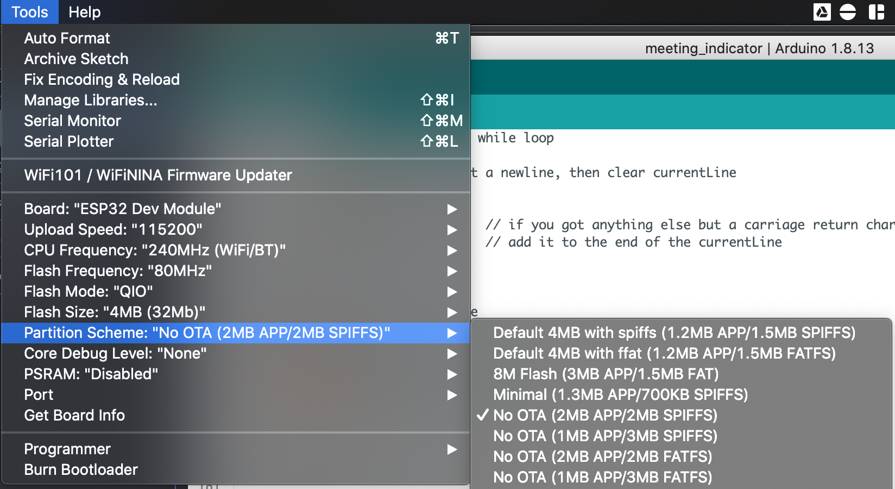
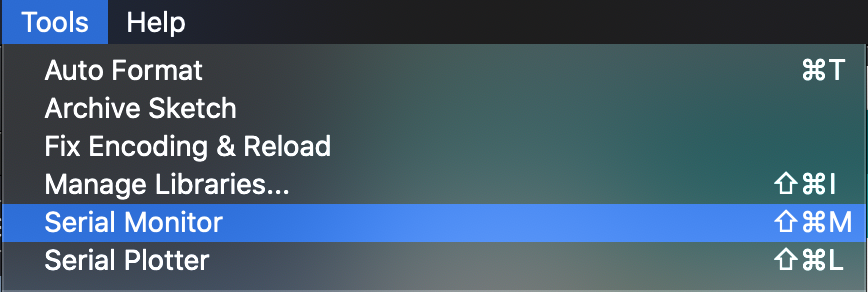

# Meeting Status Indicator



Working from home can be challenging -- especially with three, wonderful children who are doing virtual school due to COVID-19.  Yelling wasn't working and the sign I posted on my door wasn't ideal since it required them to come close to my door to find out if I was busy.  I needed a way to let the family know that I was on a meeting.

## Software Used

Programming the ESP-32,

* [Arduino IDE](https://www.arduino.cc/en/software)
* [USB-to-Serial Drivers OSX](https://www.silabs.com/developers/usb-to-uart-bridge-vcp-drivers)

For the display,
* [Gimp](https://www.gimp.org/)
* [Dokdo Google Font](https://fonts.google.com/specimen/Dokdo)

For the meeting notification script,
* [Python3](https://python.org)
* [Python Requests](https://requests.readthedocs.io/en/master/)
* [Zoom](https://zoom.us/)

## Hardware Used

* [ESP-32 WROOM-32](https://www.espressif.com/sites/default/files/documentation/esp32-wroom-32_datasheet_en.pdf) -- [Amazon](https://smile.amazon.com/HiLetgo-ESP-WROOM-32-Development-Microcontroller-Integrated/dp/B0718T232Z)
* 1x Red LED
* 1x Yellow LED
* 2x 180 ohm resistors
* Prototyping breadboard
* 1x micro-USB charger - I used an old Google Home charger
* 4x4 shadow box frame - I found one at Joann's Fabric store for about $10.  [Amazon appears to have some](https://smile.amazon.com/dp/B01GG5Y1HU/) about the same price.  I have no experience with this particular one though.
* Some hot glue
* Hole punch

## Process

### Programming the ESP-32

Using the Arduino IDE, I loaded `meeting_indicator.ino` and set my wifi ssid, wifi password and the MAC address of my bluetooth headset.

#### Adding the ESP-32 board to Arduino

Adding the ESP-32 and ESP8266 to Arduino requires loading the boards.json from the manufacturer.  You can add this in `Preferences->Additional Boards Managers URL`.



```
http://arduino.esp8266.com/stable/package_esp8266com_index.json, https://raw.githubusercontent.com/espressif/arduino-esp32/gh-pages/package_esp32_index.json
```

Add the required libraries to your Arudino IDE by opening the `boards manager` under `Tools->Boards->Boards Manager`.  Search for ESP32 in search box and select `install`. 

After the libraries are installed, select your board from the board manager.



#### Serial Port Driver

OSX requires installing the Serial Port driver from [SI Labs](https://www.silabs.com/developers/usb-to-uart-bridge-vcp-drivers).

After the drivers are installed (you might have to reboot), you can select the appropriate port under `Tools->Port`.  

#### Update `meeting_indicator.ino` variables

I started out by programming my ESP-32 with the code in `meeting_indicator.ino`.  This required setting my wifi ssid and password and getting the MAC address of my bluetooth headset.  Once uploaded, I 

#### Upload your sketch to the ESP-32

Click the upload icon to compile and upload the code to the ESP32.  Once it's complete, the board will reset.  



If you run into issues with the program being too large for the board, try changing the `Partition Scheme` under `Tools` to `No OTA (2MB APP/2MB SPIFFS)`.

### Get IP from the Serial Monitor



Open the serial montior as shown above to get the IP address from the board's output.  If it's already scrolled past, just hit the reset button on the board and it'll be one of the first things displayed.

_**Note:** I recommend setting a static IP for your board on your home router.  It'll make the notification script easier to manage._

### Meeting Notification Script

Associated scripts were written on a system running Python 3 on OS X.  The `main.py` script works by checking for Zoom in the running processes.  If the running processes includes an ID, then it'll attempt to open the crashlog/debug log matching the PID of the process from Zoom in `~/Library/Logs/zoom.us/crashlog/{pid}.log`.  It will find the most recent meeting ID and either turn on or off the LED by performing a GET request to the board.

#### URLs for your board
http://<board_ip>/meeting/on
http://<board_ip>/meeting/off

Update the script with the IP of your board.  

#### Virtual Environment

I recommend creating a virtual environment to execute the script.  This will let you keep the libraries set and prevents messing up your system libraries.

```
python3 -m venv ~/monitor/venv
~/monitor/venv/pip3 install requests
```

#### Execution

You can run this by either using cron or a project like [Bitbar](https://github.com/matryer/bitbar).  I chose Bitbar by adding the `scripts/ZoomMonitor.sh` in my Bitbar Plugins folder.  

If you choose Bitbar, make sure to update the paths to match your repository's location.

A cron example to run the script every minute:
```
* * * * * ~/monitor/venv/python ~/monitor/scripts/main.py
```

#### Server Output 

The web server service on the board will output its current status as json.  This allows for another service to integrate the service (think extra boards or a Grafana Dashboard).

**Example output:**
```
{
  "meeting":  true, 
  "headphones":  false 
}
```

### Hardware Build

The script is set to utilize pins 26 and 27 on the ESP32.  Pin 26 will control the LED for Meetings and Pin 27 will control the LED for the Headphones detection. I utilized the GND connection from the ESP32 to the LEDs.  I wasn't sure if the ESP was putting off 5V or 3.3V and I'm lazy -- so I assumed it was 5V when performing my calculations.

Since we are powering through USB, the LEDs need the resistors to not burnout when the circuit is closed.  The 180 ohm resistors were selected using the [formula I found on step 6 in this article](https://www.instructables.com/LEDs-for-Beginners/):

/Lc%20=%20R)

```
(5 - 1.5)/.02 = 175 ohms
175 --> 180 because that's the closest I had

Iv = Input Voltage (5V)
Lv = LED Voltage (1.5V)
Lc = LED Current (20mA == .02 amps)
```

TODO: Create diagram of electric circuit

ESP32 --> Pin 26 --> Resistor --> + on LED
ESP32 --> Pin 27 --> Resistor --> + on LED
ESP32 --> GND --> - on both LEDs
USB Charger --> Power on ESP32

Feel free to use the attached image to insert into your frame.  I've included the gimp source document and the font if you wish to change it up a bit.  The image was made to be printed as a 4x6 which can be cut down to size.  I assumed a 4-inch by 4-inch frame with a 1/4" border around it.  Using a 4x6 image made it easy to submit the job to a local 1-hour photo place since I don't have a color printer.

A hole punch was used to create the holes in the picture and the LEDs were glued into place by placing a bit of hot glue on the back glass and pressing the LED into it. 

## References

* This project was inspired by a tweet from [Steve Force @cairn4](https://twitter.com/cairn4/status/1245539977993355265).
* User fanuch got me started with his [solution for notifying his Hubitat when they are on a meeting](https://community.home-assistant.io/t/zoom-meeting-monitoring-to-ha/246336).  This was a welcome find for figuring out how to detect meetings.
* I used some code examples on a [project from Answith Raj](https://circuitdigest.com/microcontroller-projects/esp32-ble-client-connecting-to-fitness-band-to-trigger-light) for tracking their fitness band for turning on a light.
* [LEDs for Beginners](https://www.instructables.com/LEDs-for-Beginners/)
